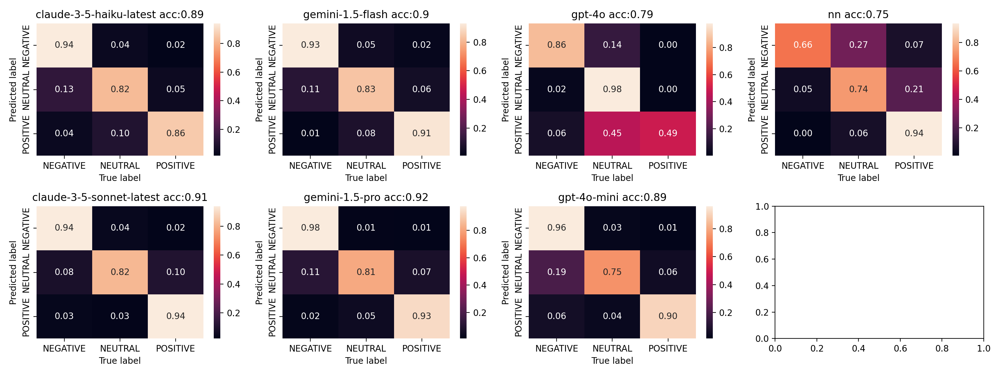

# Analysing performance of LLMs on sentiment analysis of X data for US24 elections

!important - source of data citation: https://arxiv.org/abs/2411.00376

## TLDR: taken subset of tweets from mentioned us-elections dataset
and ran: 
- `tweetnlp` (mentioned as `nn` in the plot)
- `gpt-4o`
- `gpt-4o-mini`
- `claude-3-5-sonnet-latest`
- `claude-3-5-haiku-latest`
- `gemini-1.5-pro`
- `gemini-1.5-flash`

Result confusion matrix after majority voting for GT:


## Original setup for personal running
```
mkdir project
cd project
git clone https://github.com/sinking8/usc-x-24-us-election.git
git clone https://github.com/liepieshov/genai-analysis-x-24-us-elections.git
cd genai-analysis-x-24-us-elections

# start using notebooks
# note: the requirements.txt is not listed, but they are quite straitforward.
```


## Output data

License:

This dataset is licensed under the Creative Commons Attribution-NonCommercial-ShareAlike 4.0 International Public License (CC BY-NC-SA 4.0). By using this dataset, you agree to abide by the stipulations in the license and cite the following manuscript:

https://arxiv.org/abs/2411.00376


Output data files for all notebooks (except `data.csv` from 001_*.nb):
- https://drive.google.com/drive/folders/1wfJte4qq8TdC11KqTvj4RBEXvZBXPvb-?usp=sharing
